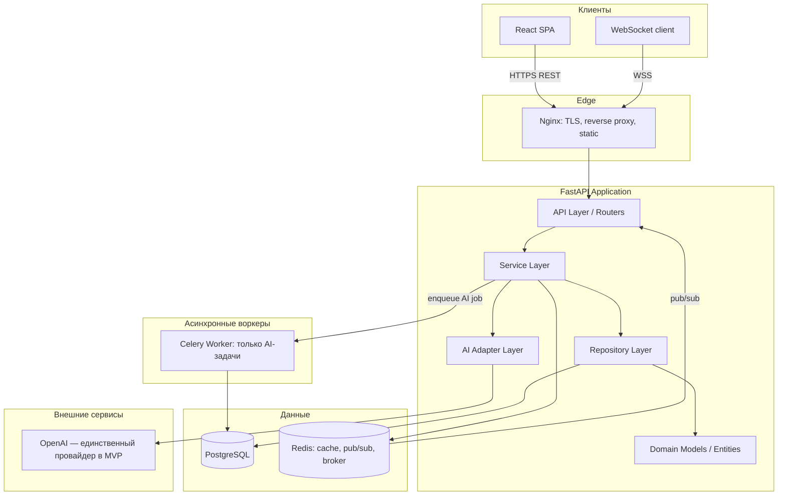
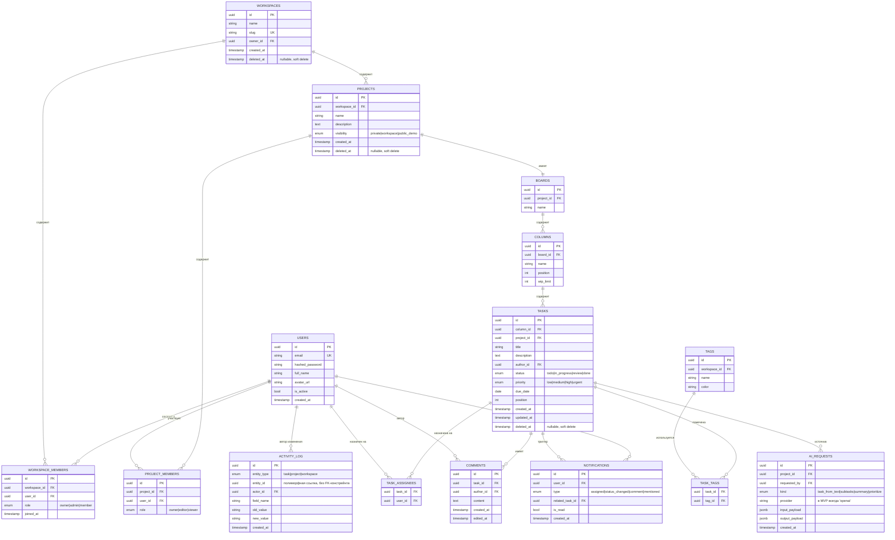
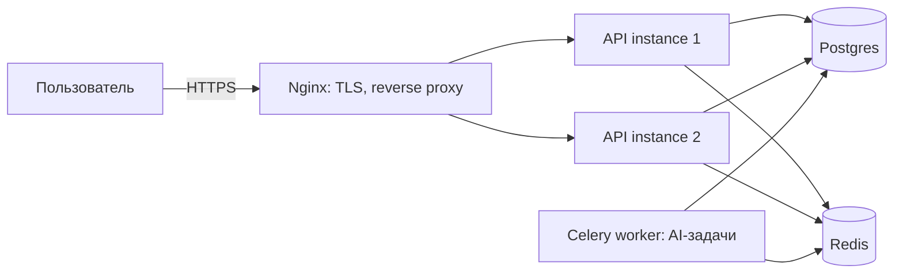

# TaskFlow — Этап 1: Product & Architecture Design

> **v1.2** — v1.1 (сокращение MVP, упрощение слоёв, soft delete, pagination, Developer Experience) + финальные штрихи: ADR, версионирование API, commit convention, детализированный seed demo, целевая структура `docs/`.
> Цель документа: зафиксировать scope, архитектуру, модель данных, API-контракт и план работ настолько подробно, чтобы Этап 2 (структура репозитория) и Этап 3 (Docker/окружение) можно было начинать без дополнительных решений «на ходу».

---

## 1. Product Requirements Document (PRD)

### 1.1 Видение продукта
TaskFlow — self-hosted / cloud-ready система управления задачами для команд разработки, сочетающая гибкость Trello (Kanban), структурированность Jira (workflow, приоритеты, история) и скорость Linear (клавиатурные шорткаты, realtime, чистый UI). Отличительная черта — встроенный AI-слой, который умеет декомпозировать текстовое описание задачи на структурированный план работ.

### 1.2 Целевая аудитория
- Небольшие и средние продуктовые команды (3–50 человек).
- Тимлиды, которым нужна легковесная альтернатива Jira без избыточной сложности.
- В контексте этого проекта — вторичная аудитория: технический рекрутер/интервьюер, оценивающий репозиторий как портфолио.

### 1.3 MVP Scope — Portfolio MVP (пересмотрено после Tech Lead review)

**Проблема первой версии scope**: в него одновременно попали JWT+refresh, RBAC, Kanban, realtime, Redis Pub/Sub, Celery, email, полнотекстовый поиск, AI-слой на 4 провайдера, вложения, мониторинг и production CI/CD. Для команды это нормальный набор для одного релиза, для одного разработчика — это проект на 6–12 месяцев, а риск для портфолио в том, что можно получить впечатляющую архитектуру без работающего продукта. Решение: жёстко разделить **Portfolio MVP** (то, что действительно будет закончено и задеплоено) и **Roadmap** (спроектировано и описано, но не реализуется в первой версии).

| Область | Portfolio MVP | Roadmap (после MVP) |
|---|---|---|
| Auth | Email+пароль, JWT (access+refresh) | OAuth2 (Google/GitHub), восстановление пароля по email |
| Workspace | Создание, приглашение участника, роли Owner/Admin/Member | SSO, биллинг, тарифные планы |
| Проекты | CRUD, участники, настройки доступа | Шаблоны проектов, портфели проектов |
| Kanban | Колонки, карточки, drag&drop, realtime | Несколько досок на проект (Swimlanes) |
| Задачи | Поля из ТЗ (без вложений), история изменений | Вложения (file upload), подзадачи с зависимостями, тайм-трекинг |
| Комментарии | CRUD, упоминания (@mention) | Реакции, threads |
| Уведомления | In-app realtime (WebSocket + БД) | Email-доставка, дайджесты по расписанию, push в браузере/мобиле |
| Поиск/фильтры | Базовый фильтр и сортировка как часть `GET /tasks` (без отдельного модуля) | Полнотекстовый поиск (tsvector), saved views, сложные фильтры-конструкторы |
| AI | Разбор текста → задача/подзадачи, breakdown, summary — **только один провайдер (OpenAI)** за общим интерфейсом | AnthropicProvider, GeminiProvider, OpenRouterProvider — подключаются без изменения вызывающего кода |
| Инфраструктура | Docker, CI (lint+test+build), demo-деплой, Public Demo | Celery Beat, Prometheus/метрики, autoscaling |

Критерий отбора в MVP был простой: **фича должна быть видна и осязаема в работающем демо**, а не только в коде. Всё, что попало в Roadmap, оставлено в схеме БД и архитектуре так, чтобы добавляться инкрементально (новая миграция + новый модуль), а не переписыванием существующего.

### 1.4 Ключевые пользовательские сценарии (User Stories)
1. Как Owner, я создаю workspace и приглашаю коллег по email, назначая им роли.
2. Как Member, я открываю доску проекта и перетаскиваю карточку между колонками — изменение видят все участники в реальном времени.
3. Как исполнитель, я вижу realtime-уведомление в приложении, когда мне назначили задачу или изменили её статус (email и дедлайн-дайджесты — Roadmap, требуют Celery Beat).
4. Как PM, я пишу «Нужен лендинг с формой обратной связи» — AI создаёт задачу с чек-листом подзадач (дизайн, вёрстка, форма, деплой).
5. Как рекрутер, я открываю Public Demo без регистрации и вижу заполненный демо-workspace.

### 1.5 Метрики успеха (для портфолио — technical KPIs)
- Test coverage backend ≥ 80% на core-модулях (auth, tasks, workspace).
- P95 latency основных REST-эндпоинтов < 150 мс на локальном dev-стенде.
- 0 критичных находок при базовом security-чек-листе (см. раздел 7).
- CI pipeline (lint → typecheck → test → build) проходит < 5 мин.

### 1.6 Нефункциональные требования
- **Безопасность**: OWASP ASVS L1 как базовый ориентир, hashing паролей — Argon2id, rate limiting на auth-эндпоинтах.
- **Масштабируемость**: stateless backend (горизонтальное масштабирование за Nginx/LB), Redis для pub/sub и кэша, Celery-воркеры отдельно от API.
- **Наблюдаемость**: структурированные логи (JSON), health-check эндпоинты, метрики Prometheus-совместимые (задел на будущее).
- **Поддерживаемость**: строгая типизация (MyPy strict), единый стиль (Ruff+Black), pre-commit hooks, ADR (Architecture Decision Records) для ключевых решений.

---

## 2. Архитектура системы

### 2.1 Архитектурный стиль
Модульный монолит на Clean Architecture с чёткими границами между слоями. Не микросервисы — для портфолио-проекта такого масштаба микросервисы добавили бы operational overhead без выгоды, а модульный монолит с явными границами модулей демонстрирует зрелость проектирования и при этом остаётся *deployable and reviewable* за разумное время.


*Изменение после review: убраны Celery Beat и SMTP — без email и дедлайн-дайджестов в MVP они не нужны; Celery остаётся только для асинхронных AI-запросов (LLM-вызов может занимать секунды, блокировать им HTTP-запрос — плохой UX).*

### 2.2 Слои архитектуры (пересмотрено — flat modules вместо 4-уровневой Clean Architecture)

**Изменение после review**: формальное разделение Domain / Application / Interface Adapters / Infrastructure на масштаб этого проекта избыточно — в Python это превращается в "интерфейсы ради интерфейсов", а не в реальную защиту от смены технологий. Принцип инверсии зависимостей остаётся, но выражается проще — через один уровень абстракции (репозитории), а не через четыре именованных слоя.

```
app/
├── modules/
│   ├── auth/
│   ├── users/
│   ├── workspace/
│   ├── projects/
│   ├── tasks/
│   ├── comments/
│   ├── notifications/
│   ├── ai/
│   └── websocket/
├── core/          # конфигурация, security, DI, middleware, exceptions
├── database/       # engine, session factory, Base, Alembic env
└── shared/          # общие утилиты, pagination-хелперы, базовые Pydantic-схемы
```

Внутри каждого модуля — единый плоский набор файлов:
```
tasks/
├── model.py         # SQLAlchemy-модель (она же основная бизнес-сущность модуля)
├── schema.py         # Pydantic DTO (Create/Update/Read)
├── repository.py      # TaskRepository(Protocol) + PostgresTaskRepository
├── service.py           # бизнес-логика, права доступа, транзакции
└── router.py              # FastAPI endpoints
```
Единственная граница, которая реально защищает от протечки деталей БД в бизнес-логику — интерфейс репозитория (`Protocol`). Этого достаточно, чтобы:
- подменять реализацию в unit-тестах (in-memory repo вместо Postgres);
- не завязывать service-слой на конкретный ORM-вызов.

**Точечное исключение — `tasks`**: это единственный модуль, где ORM-модель и доменная логика не тождественны (правила смены статуса, WIP-лимит колонки, проверки прав на move). Для него в `tasks/` появится `entity.py` — лёгкий dataclass с этой логикой, которым `service.py` оперирует, а `repository.py` мапит его в/из `model.py`. Остальные модули (`comments`, `tags`, `notifications` и т.д.) — CRUD без доменной логики, там ORM-модель = доменная модель, и заводить для них отдельный `entities.py` было бы just abstraction for abstraction's sake. Это компромисс между пунктами ревью 2 и 3: не тащим domain/infrastructure-разделение на весь проект, но и не растворяем единственное место с реальной бизнес-логикой в ORM-классе.

### 2.3 Ключевые паттерны и их обоснование
- **Repository Pattern** — изолирует SQLAlchemy от бизнес-логики; сервисы работают с `TaskRepository.get_by_id()`, а не с `session.query(Task)`.
- **Service Layer** — единая точка входа для юзкейса (`TaskService.assign_task(...)`), включает проверки прав доступа, транзакционность, публикацию событий.
- **Dependency Injection** — через `FastAPI Depends()` + фабрики в `core/dependencies.py`; сервисы и репозитории не создают свои зависимости сами.
- **Adapter Pattern (AI)** — единый интерфейс `AIProvider` (`generate_subtasks()`, `summarize()`, `prioritize()`). **В MVP — только `OpenAIProvider`.** Ценность паттерна не теряется от того, что реализация одна: интерфейс уже зафиксирован, `AnthropicProvider`/`GeminiProvider`/`OpenRouterProvider` добавляются позже без изменения `AIService` — это и есть демонстрация "provider abstraction allows swapping LLM vendors" в README, без необходимости реализовывать все четыре сразу.
- **Unit of Work** — обёртка над SQLAlchemy Session для атомарности операций, затрагивающих несколько репозиториев (например, создание задачи + запись в activity log + realtime-событие).
- **Event-driven уведомления** — доменные события (`TaskAssigned`, `CommentAdded`) публикуются в сервисе и обрабатываются notification-модулем (in-process event bus; продюсится только модулями `tasks`, `comments`, `workspace`, где реально есть на что подписываться — не заводится по умолчанию в каждом модуле).
- **Security-утилиты как отдельный под-пакет** (добавлено после review) — `core/security/{jwt.py, permissions.py, password.py}`: явно выделенное место для JWT-кодирования, RBAC-проверок и хэширования паролей, а не разбросанные по сервисам детали.

### 2.4 Технологический стек и обоснование

| Категория | Технология | Почему |
|---|---|---|
| API framework | FastAPI | Async-first, автогенерация OpenAPI, нативная интеграция с Pydantic v2 |
| ORM | SQLAlchemy 2.0 (async) | Zero-compromise типизация, Unit of Work из коробки, зрелая экосистема |
| Миграции | Alembic | Стандарт де-факто для SQLAlchemy |
| Валидация | Pydantic v2 | Производительность (Rust core), строгая типизация схем API |
| БД | PostgreSQL 16 | JSONB для гибких полей (например, метаданные AI), надёжность, полнотекстовый поиск (`tsvector`) без доп. Elasticsearch на старте |
| Кэш / брокер | Redis | Кэш сессий/rate-limit, pub/sub для WebSocket fan-out, брокер для Celery |
| Очереди задач | Celery + Redis (**только AI-задачи в MVP**) | LLM-вызов может занимать секунды — выносим из HTTP request-response цикла. Email/дедлайн-джобы (Celery Beat) — Roadmap |
| Realtime | FastAPI WebSocket + Redis Pub/Sub | Горизонтальное масштабирование WS без sticky sessions на уровне приложения |
| Auth | JWT (access+refresh rotation) | Индустриальный стандарт, достаточно для MVP; OAuth2 — Roadmap |
| Frontend | React + TypeScript + TailwindCSS + **TanStack Query** (серверный стейт, кэш, инвалидация) + **Zustand** (лёгкий локальный/глобальный клиентский стейт, например состояние доски при drag&drop) | Актуальный стек; TanStack Query избавляет от ручного кэширования fetch-запросов, Zustand — без boilerplate Redux |
| Контейнеризация | Docker + Docker Compose | Единообразный dev/stage/prod запуск |
| Reverse proxy | Nginx | TLS termination, статика, балансировка |
| CI/CD | GitHub Actions | Нативная интеграция с GitHub-портфолио |

---

## 3. Описание модулей (Backend)

Структура и файлы внутри модуля зафиксированы в разделе 2.2 (flat `modules/`). Ниже — зона ответственности каждого модуля в границах Portfolio MVP.

| Модуль | Ответственность в MVP | Явно не входит (Roadmap) |
|---|---|---|
| `auth` | Регистрация, логин, JWT access+refresh, logout | OAuth2, password reset |
| `users` | Профиль, настройки аккаунта | — |
| `workspace` | Workspaces, участники, роли (RBAC: Owner/Admin/Member) | SSO, биллинг |
| `projects` | Проекты, участники проекта, базовая статистика, Public Demo видимость | Шаблоны проектов |
| `tasks` | Boards, columns, tasks, tags, activity log, drag&drop, фильтр/сортировка списка задач | Вложения, подзадачи-с-зависимостями, полнотекстовый поиск |
| `comments` | CRUD комментариев, @mention | Реакции, threads |
| `notifications` | In-app события (assigned/status_changed/comment/mentioned), доставка через WebSocket + хранение в БД | Email-доставка, дайджесты (Celery Beat) |
| `ai` | `AIProvider` интерфейс + `OpenAIProvider`, use-cases (generate/breakdown/summary) | Anthropic/Gemini/OpenRouter адаптеры |
| `websocket` | Connection manager, fan-out событий через Redis Pub/Sub | — |

Такая консистентность структуры (см. 2.2) — сама по себе сигнал качества для ревьюера кода: любой новый модуль добавляется по шаблону, онбординг нового разработчика занимает минуты, а не часы. Отдельного модуля `search` в MVP нет — фильтрация и сортировка живут как query-параметры эндпоинта списка задач внутри `tasks` (см. 5.5), чтобы не плодить модуль ради нескольких `WHERE`-условий.

### 3.1 Границы модулей и правило импортов
- Модули не импортируют друг друга напрямую на уровне репозиториев — только через интерфейсы сервисов (`tasks` может вызвать `NotificationService.notify(...)`, но не трогает `notifications.repository` напрямую).
- Кросс-модульная коммуникация — либо прямой вызов сервиса, либо доменное событие (для слабо связанных случаев, например уведомления).

---

## 4. Схема базы данных

### 4.1 ER-диаграмма (ключевые сущности)


*Изменения после review: убрана `ATTACHMENTS` (вложения — Roadmap, таблица появится вместе с фичей, не раньше); `TASK_HISTORY` обобщена в `ACTIVITY_LOG` с `entity_type/entity_id` — используется и для истории задачи, и для будущего аудита workspace/project (смена роли, удаление участника), без дублирования кода логирования; добавлен `deleted_at` на `workspaces/projects/tasks`; `search_vector` убран из MVP-полей `tasks` вместе с модулем полнотекстового поиска (Roadmap).*

### 4.2 Дизайн-решения по схеме
- **UUID вместо serial ID** — безопаснее для публичного API (нельзя перебором угадать соседние объекты), удобно для будущей репликации/шардирования.
- **Soft delete (`deleted_at`) на `workspaces`, `projects`, `tasks`** *(добавлено после review)* — для таск-трекера безвозвратное удаление задачи или проекта — плохой UX (случайный клик стирает работу команды). Репозитории по умолчанию фильтруют `deleted_at IS NULL`; жёсткое удаление — отдельная, редко используемая операция.
- **`ACTIVITY_LOG` как единый append-only полиморфный лог** *(обобщено после review)* — вместо отдельной `TASK_HISTORY` и будущего отдельного `audit`-модуля один и тот же код записи истории обслуживает и изменения задачи, и (в Roadmap) аудит workspace/project — одна точка ответственности вместо двух похожих реализаций истории.
- **`PROJECT_MEMBERS` отдельно от `WORKSPACE_MEMBERS`** — участник workspace не обязательно имеет доступ к каждому проекту (поддержка приватных проектов внутри workspace).
- **`visibility=public_demo` на проекте** — механизм для Public Demo режима: один seed-проект помечается публичным, отдаётся read-only без авторизации через отдельный роут; явно исключается из выдачи любых списков "мои проекты"/статистики других пользователей на уровне репозитория, а не только в UI.
- Все FK — `ON DELETE CASCADE` для дочерних сущностей задачи (comments, activity log) и soft-delete вместо `ON DELETE` для workspace/project/task, чтобы не терять данные по ошибке.

---

## 5. API дизайн

Базовый префикс: `/api/v1`. Формат ошибок — единый `ProblemDetail` (RFC 7807-подобный): `{"type", "title", "status", "detail", "instance"}`.

### 5.0 Пагинация *(добавлено после review)*
Все list-эндпоинты (`/workspaces`, `/projects`, `/tasks`, `/notifications`, `/comments`) с самого MVP принимают `?limit=&offset=` (по умолчанию `limit=50`, максимум `limit=200`) и возвращают единый конверт:
```json
{ "items": [...], "total": 137, "limit": 50, "offset": 0 }
```
Контракт фиксируется сразу, чтобы не ломать клиентов при росте данных — переход на курсорную пагинацию для по-настоящему больших списков (если понадобится) возможен позже без смены формы ответа для потребителя (просто `offset` заменится на `cursor`).

### 5.0.1 Версионирование API *(добавлено после review)*
Правило фиксируется явно: **`/api/v1` не ломается обратной совместимостью после релиза**. Любое изменение, меняющее форму существующего ответа, обязательный статус поля или семантику эндпоинта, выходит как `/api/v2`, со старым `/api/v1` в режиме поддержки на объявленный deprecation-период. Аддитивные изменения (новое опциональное поле, новый эндпоинт) в `v1` — допустимы и не требуют новой версии. Это же правило будет закреплено в `CONTRIBUTING.md` на Этапе 13.

### 5.1 Auth
| Метод | Путь | Описание |
|---|---|---|
| POST | `/auth/register` | Регистрация по email+паролю |
| POST | `/auth/login` | Логин, возвращает access+refresh JWT |
| POST | `/auth/refresh` | Обновление access-токена |
| POST | `/auth/logout` | Инвалидация refresh-токена |

*Roadmap (не в MVP): `/auth/password/forgot` + `/auth/password/reset` (требуют email-доставку), `/auth/oauth/{provider}/authorize` + `/callback` (OAuth2). Не реализуются в первой версии, но JWT-слой в `core/security/jwt.py` спроектирован так, чтобы добавление не требовало менять контракт существующих эндпоинтов.*

### 5.2 Users
| Метод | Путь | Описание |
|---|---|---|
| GET | `/users/me` | Текущий профиль |
| PATCH | `/users/me` | Обновление профиля |
| POST | `/users/me/avatar` | Загрузка аватара |

### 5.3 Workspaces
| Метод | Путь | Описание |
|---|---|---|
| POST | `/workspaces` | Создать workspace |
| GET | `/workspaces` | Список моих workspace |
| GET | `/workspaces/{id}` | Детали |
| PATCH | `/workspaces/{id}` | Обновить |
| POST | `/workspaces/{id}/invite` | Пригласить участника (email) |
| PATCH | `/workspaces/{id}/members/{user_id}` | Изменить роль |
| DELETE | `/workspaces/{id}/members/{user_id}` | Удалить участника |

### 5.4 Projects / Boards
| Метод | Путь | Описание |
|---|---|---|
| POST | `/workspaces/{ws_id}/projects` | Создать проект |
| GET | `/workspaces/{ws_id}/projects` | Список проектов |
| GET | `/projects/{id}` | Детали + статистика |
| PATCH | `/projects/{id}` | Обновить настройки/доступ |
| DELETE | `/projects/{id}` | Удалить |
| GET | `/projects/{id}/board` | Доска с колонками и задачами |
| POST | `/projects/{id}/columns` | Добавить колонку |
| PATCH | `/columns/{id}` | Переименовать / изменить WIP-лимит |
| PATCH | `/columns/{id}/reorder` | Изменить порядок колонок |

### 5.5 Tasks
| Метод | Путь | Описание |
|---|---|---|
| POST | `/projects/{id}/tasks` | Создать задачу |
| GET | `/projects/{id}/tasks?q=&status=&priority=&assignee=&tags=&sort=&limit=&offset=` | Список задач проекта с фильтром, сортировкой и пагинацией (заменяет отдельный `/search`) |
| GET | `/tasks/{id}` | Детали задачи |
| PATCH | `/tasks/{id}` | Обновить поля |
| PATCH | `/tasks/{id}/move` | Переместить между колонками/позициями (drag&drop) |
| DELETE | `/tasks/{id}` | Soft delete (`deleted_at`) |
| POST | `/tasks/{id}/assignees` | Назначить исполнителя |
| GET | `/tasks/{id}/history` | Записи `ACTIVITY_LOG` по этой задаче |

*Roadmap: `POST /tasks/{id}/attachments` (загрузка вложений) — не в MVP.*

### 5.6 Comments
| Метод | Путь | Описание |
|---|---|---|
| POST | `/tasks/{id}/comments` | Добавить комментарий |
| PATCH | `/comments/{id}` | Редактировать |
| DELETE | `/comments/{id}` | Удалить |

### 5.7 Notifications
| Метод | Путь | Описание |
|---|---|---|
| GET | `/notifications?limit=&offset=` | Список уведомлений (пагинация) |
| PATCH | `/notifications/{id}/read` | Отметить прочитанным |

*Поиск/фильтрация задач — не отдельный роут, см. `GET /projects/{id}/tasks` в 5.5. Полнотекстовый поиск (tsvector) по всем проектам workspace — Roadmap.*

### 5.8 AI
| Метод | Путь | Описание |
|---|---|---|
| POST | `/ai/tasks/generate` | Текст → структурированная задача с подзадачами |
| POST | `/ai/tasks/{id}/breakdown` | Разбить существующую задачу на подзадачи |
| POST | `/ai/projects/{id}/summary` | Summary проекта |
| POST | `/ai/projects/{id}/prioritize` | Рекомендации по приоритетам |

### 5.9 Public Demo
| Метод | Путь | Описание |
|---|---|---|
| GET | `/public/demo/project` | Read-only доступ к демо-проекту без авторизации |

### 5.10 WebSocket
`WSS /ws/projects/{project_id}?token=<jwt>`

События (server → client): `task.created`, `task.updated`, `task.moved`, `task.deleted`, `comment.created`, `notification.created`, `member.online` / `member.offline`.
Транспорт fan-out между инстансами API — Redis Pub/Sub канал `project:{id}`, что позволяет держать несколько реплик backend за балансировщиком без sticky sessions.

**Реализовано на Этапе 8**: `task.created/updated/moved/deleted`, `comment.created`,
`notification.created` — публикуются из `TaskService`/`CommentService` (см.
ADR-0008). `member.online`/`member.offline` — не реализованы: presence
(кто сейчас смотрит доску) не запрашивался явно и не имеет пока
потребителя на фронтенде (Этап 9). `notification.created` — известное
ограничение: публикуется в комнату проекта, не персонально пользователю
(WS-контракт комнатный, не per-user) — подробности в ADR-0008.

### 5.11 Аутентификация запросов
`Authorization: Bearer <access_jwt>`, access-токен живёт 15 мин, refresh — 30 дней (хранится как httpOnly secure cookie для веб-клиента). Все mutating-эндпоинты защищены RBAC-проверкой на уровне сервиса (не только роутера) — на случай, если сервис вызывается не из HTTP-слоя (например, из Celery-таски).

---

## 6. План разработки (Roadmap по этапам)

| Этап | Содержание | Ключевой результат |
|---|---|---|
| 1 (текущий) | Архитектура и проектирование | Этот документ |
| 2 | Структура репозитория, базовый скелет FastAPI + React | Пустой, но запускаемый проект |
| 3 | Docker, docker-compose, окружение, pre-commit, CI skeleton | `docker-compose up` поднимает всё |
| 4 | Database layer: модели, Alembic, базовые миграции | Схема из раздела 4 в БД |
| 5 | Authentication: JWT access+refresh | Auth-флоу с тестами (OAuth2/password reset — после MVP) |
| 6 | Users, Workspace, RBAC | Управление командой |
| 7 | Projects, Tasks, Kanban REST API | Полный CRUD + drag&drop backend |
| 8 | Realtime: WebSocket, Redis pub/sub, notifications | Live-обновления доски |
| 9 | Frontend: React SPA поверх API | Рабочий UI |
| 10 | AI-слой: адаптеры провайдеров, генерация задач | Работающий AI-ассистент |
| 11 | Testing: unit/integration/API, повышение coverage | ≥80% на core-модулях |
| 12 | Deployment: production Docker, Nginx, HTTPS, CI/CD | Работающий деплой на сервер |
| 13 | GitHub-портфолио: README, скриншоты, demo, история коммитов | Репозиторий готов к показу |

Каждый этап заканчивается отдельным набором коммитов (не одним гигантским) и коротким ревью от Tech Lead-роли: что сделано, какие риски, что дальше.

### 6.1 Roadmap после Portfolio MVP (Этап 13 и далее)
Осознанно отложено, чтобы не размывать фокус на "закончить работающий продукт":
- OAuth2 (Google/GitHub) и восстановление пароля по email
- Вложения к задачам (file upload + хранилище)
- Email-доставка уведомлений + Celery Beat (дедлайн-дайджесты)
- `AnthropicProvider`, `GeminiProvider`, `OpenRouterProvider` для AI-слоя
- Полнотекстовый поиск (tsvector) и saved views
- Prometheus-метрики и мониторинг
- Swimlanes / несколько досок на проект, подзадачи с зависимостями, тайм-трекинг

Каждый пункт — отдельный, самостоятельно оцениваемый кусок работы поверх уже готовой архитектуры, а не переделка существующего.

---

## 7. Стратегия тестирования

### 7.1 Пирамида тестов
- **Unit-тесты** (большинство): сервисы и доменная логика с замоканными репозиториями (in-memory реализация Protocol). Быстрые, без БД.
- **Integration-тесты**: репозитории и Alembic-миграции против реального Postgres в Docker (через `testcontainers` или compose-профиль `test`).
- **API-тесты**: end-to-end через `httpx.AsyncClient` + тестовую БД — проверяют полный путь запрос→ответ, включая auth и валидацию.
- **Contract-тесты AI-адаптеров**: моки провайдеров с фиксированными фикстурами ответов — исключают реальные вызовы к LLM в CI.

### 7.2 Инструменты
Pytest, `pytest-asyncio`, `pytest-cov`, `factory_boy`/`polyfactory` для фикстур, `httpx` для API-тестов, `freezegun` для тестов, зависящих от времени (дедлайны).

### 7.3 Целевые метрики
Coverage ≥80% на `auth`, `tasks`, `workspace`; ≥60% в среднем по проекту. Каждый PR обязан проходить `pytest --cov` в CI до мержа.

### 7.4 Security-чек-лист (проверяется вручную на Этапе 11)
- Пароли — только Argon2id, не логируются, не возвращаются в API.
- Rate limiting на `/auth/login` и `/auth/register` (Redis-based).
- Валидация всех входных данных через Pydantic (никаких raw dict в сервисах).
- SQL — только через SQLAlchemy ORM/Core, без строковой конкатенации.
- CORS настроен явным whitelist, не `*`.
- Секреты — только через переменные окружения / `.env` (не в коде, `.env` в `.gitignore`).
- JWT — короткий TTL access-токена, ротация refresh-токена, возможность revoke.

---

## 8. План деплоя

### 8.1 Локальная среда
```
docker-compose up
```
Поднимает: `api` (FastAPI), `worker` (Celery — только AI-задачи), `db` (Postgres), `redis`, `frontend` (React dev-server или собранная статика), `nginx`. *(`beat` убран после review — без email/дедлайн-джобов в MVP планировщик не нужен.)*

### 8.2 Окружения
`local` → `staging` → `production`, конфигурация через `.env` файлы (`.env.example` в репозитории с плейсхолдерами) и `pydantic-settings` для строгой валидации переменных при старте приложения.

### 8.3 Production-топология


### 8.4 CI/CD (GitHub Actions)
Pipeline: `lint (Ruff) → format-check (Black) → typecheck (MyPy) → test (Pytest+coverage) → build (Docker image) → push to registry → deploy (SSH/Compose pull на сервере)`. Ветка `main` защищена, деплой в production — только по тегу релиза.

### 8.5 Наблюдаемость на проде
`/health` и `/health/ready` эндпоинты (readiness проверяет соединение с Postgres/Redis), структурированные JSON-логи в stdout (совместимо с любым лог-агрегатором), базовые метрики через `prometheus-fastapi-instrumentator` (задел на будущее, не блокирует MVP).

---

## 9. Developer Experience *(добавлено после review)*

Для GitHub-портфолио этот раздел значит больше, чем кажется: рекрутер/интервьюер в среднем тратит на репозиторий пару минут, и первое, что он делает — пытается его запустить. Цель — ноль трения между `git clone` и работающим приложением.

### 9.1 Быстрый старт
```bash
git clone <repo>
cd taskflow
cp .env.example .env
docker compose up
# backend:  http://localhost:8000/docs   (Swagger UI)
# frontend: http://localhost:3000
```
Никаких дополнительных ручных шагов (создание БД, применение миграций и seed демо-данных выполняются автоматически при старте `api`-контейнера).

### 9.2 Makefile
| Команда | Действие |
|---|---|
| `make dev` | Поднять окружение в dev-режиме с hot-reload |
| `make test` | Прогнать полный набор тестов с coverage |
| `make lint` | Ruff + MyPy |
| `make format` | Black + Ruff --fix |
| `make migrate` | Применить Alembic-миграции |
| `make seed` | Наполнить БД демо-данными (в т.ч. Public Demo workspace) |

### 9.3 Pre-commit
`pre-commit` hook прогоняет `ruff`, `black --check`, `mypy` перед каждым коммитом — не даёт закоммитить код, который не пройдёт CI.

### 9.4 Commit Convention *(добавлено после review)*
Используем **Conventional Commits** с первого коммита в репозитории (это же и формирует "историю разработки по этапам" из исходного ТЗ):

| Тип | Когда использовать |
|---|---|
| `feat:` | Новая функциональность |
| `fix:` | Исправление бага |
| `refactor:` | Изменение кода без изменения поведения |
| `docs:` | Изменения только в документации |
| `test:` | Добавление/правка тестов |
| `chore:` | Обновление зависимостей, конфигов, рутина |
| `ci:` | Изменения в CI/CD pipeline |

Пример истории коммитов по Этапу 4: `feat(database): add workspace and project models`, `feat(database): add task and column models with soft delete`, `chore(database): configure alembic env`. Формат: `<type>(<module>): <краткое описание в повелительном наклонении>`. Ветка `main` защищена — коммиты такого вида приходят через PR, что заодно даёт естественные точки для CI-прогона.

### 9.5 Seed Demo Data *(детализировано после review)*
Для `make seed` и Public Demo нужен не пустой workspace, а такой, где сразу видно, что продукт "живой". Наполнение:

- **Workspace**: `Demo Company` — 12 пользователей с разными ролями (1 Owner, 2 Admin, 9 Member), у каждого осмысленное имя и аватар.
- **3 проекта**, отражающие типичный software-цикл, чтобы AI-фичи и Kanban были видны в контексте:
  - **Backend** — доска с колонками `Ideas → Development → Testing → Done`.
  - **Frontend** — аналогичная доска, другой набор задач.
  - **DevOps** — доска с инфраструктурными задачами.
- **~45 задач** суммарно по трём проектам, распределённые по всем колонкам и статусам/приоритетам (не всё в "Done" — иначе доска выглядит неживой), с назначенными исполнителями и дедлайнами в разумном разбросе (часть — просрочены, часть — на неделю вперёд).
- **Комментарии** на части задач, включая примеры `@mention`, чтобы уведомления тоже были видны.
- **Заполненный `ACTIVITY_LOG`** — история изменений на нескольких задачах (смена статуса, переназначение), чтобы вкладка "История" не была пустой.
- **2–3 сохранённых примера AI-запроса** в `AI_REQUESTS` (input/output) — например, разбор "Нужен лендинг с формой обратной связи" → сгенерированные подзадачи, чтобы AI-функциональность была видна даже без нового вызова к LLM (не требует живого API-ключа при простом просмотре демо).

Скрипт наполнения — идемпотентный (`make seed` можно запускать повторно, не плодя дубли) и используется в двух местах: локально через Makefile и в production при первом деплое Public Demo.

---

## 10. Architecture Decision Records *(добавлено после review)*

Ключевые архитектурные решения фиксируются как ADR в `docs/adr/`, а не только прозой внутри этого документа — так решения остаются атомарными, датированными и их проще пересматривать по одному, не трогая весь документ целиком. Уже написаны:

| ADR | Решение |
|---|---|
| `0001-use-fastapi.md` | FastAPI как web-framework |
| `0002-use-postgresql.md` | PostgreSQL как основная БД |
| `0003-use-uuid.md` | UUID вместо auto-increment ID |
| `0004-module-architecture.md` | Плоская модульная структура вместо 4-слойной Clean Architecture |
| `0005-ai-provider-abstraction.md` | Adapter Pattern для AI-провайдеров, один провайдер в MVP |
| `0006-repository-and-session-lifecycle.md` | Generic BaseRepository + session-per-request auto-commit (Этап 4) |
| `0007-invitation-flow.md` | Invitation — токен-based приглашения с вычисляемым статусом (Этап 6) |
| `0008-websocket-realtime.md` | WebSocket-аутентификация, ConnectionManager поверх Redis Pub/Sub (Этап 8) |

Формат единый для всех: Статус → Контекст → Решение → Последствия. Новый ADR заводится, когда решение (а) не тривиально, (б) могло бы быть принято иначе, (в) стоит денег/времени, если его придётся откатывать позже — не под каждый мелкий выбор библиотеки.

## 11. Целевая структура `docs/` *(добавлено после review)*

Этот документ (`docs/architecture-and-design.md`) на Этапе 13 будет разложен на отдельные файлы — так финальный README сможет линковать на конкретный раздел, а не на один гигантский файл:

```
docs/
├── architecture.md      # разделы 2–3 этого документа
├── api.md                 # раздел 5 (включая pagination/versioning)
├── database.md             # раздел 4 (ERD + дизайн-решения)
├── deployment.md             # раздел 8
└── adr/
    ├── 0001-use-fastapi.md
    ├── 0002-use-postgresql.md
    ├── 0003-use-uuid.md
    ├── 0004-module-architecture.md
    └── 0005-ai-provider-abstraction.md
```
PRD (раздел 1), план по этапам (раздел 6), стратегия тестирования (раздел 7) и Developer Experience (раздел 9) остаются либо в корневом `README.md`, либо в `CONTRIBUTING.md` — решается на Этапе 13 по факту того, как выглядит готовый репозиторий.

---

## Итог этапа 1 (v1.1, после Tech Lead review)

**Вердикт по ревью: принято, с двумя уточнениями от архитектора.**

Согласен полностью:
- Portfolio MVP сокращён — убраны OAuth2, password reset, вложения, email-уведомления, Celery Beat, Prometheus, мультипровайдерный AI, отдельный поисковый модуль. Всё это в Roadmap (6.1), схема и интерфейсы спроектированы так, чтобы это добавлялось инкрементально.
- 4-слойная Clean Architecture заменена на плоскую модульную структуру (2.2) — меньше абстракций ради абстракций.
- Soft delete добавлен на `workspaces/projects/tasks` (4.1–4.2).
- Pagination зафиксирован в контракте с первой версии API (5.0).
- Добавлен раздел Developer Experience (9) — quickstart, Makefile, pre-commit.
- `TASK_HISTORY` → `ACTIVITY_LOG`: не просто "добавили audit-модуль", а обобщили уже спроектированную таблицу истории задач под будущий аудит workspace/project — один код вместо двух похожих реализаций.

Два уточнения (не полное согласие "как есть"):
1. **Domain/Infrastructure разделение** — не развожу его по всем модулям (это вернуло бы ту же тяжеловесность, от которой уходим в пункте 2 ревью). Вместо этого — точечное исключение только для `tasks` (2.2), где реально есть бизнес-логика, не сводимая к ORM-полям. Остальные модули остаются CRUD с ORM-моделью как единственным представлением сущности.
2. **`due_soon`-уведомления** убраны из MVP вместе с Celery Beat, но `mentioned` — оставлен в списке типов уведомлений: @mention в комментариях остаётся в MVP-скоупе (это отдельная фича, не завязана на email/scheduler), и без realtime-уведомления о нём демо будет выглядеть недоделанным.

Зафиксировано: сокращённый scope продукта, плоская модульная архитектура, модель данных с soft delete и unified activity log, контракт API с пагинацией, DX-раздел, критерии тестирования и план деплоя без избыточных компонентов. Это основа, от которой на Этапе 2 отталкивается структура репозитория.

### Что осознанно не добавляется *(зафиксировано после review — архитектура заморожена от переусложнения)*
Kafka, RabbitMQ, микросервисы, CQRS, Event Sourcing, Kubernetes, GraphQL — ни один из этих пунктов не даёт портфолио-проекту ощутимой пользы, но каждый добавляет operational overhead, который отвлекает от главной цели: закончить работающий продукт. Если появится соблазн добавить что-то из этого списка на следующих этапах — это сигнал вернуться к разделу 1.3 и вспомнить критерий отбора в MVP.

### Риски и открытые вопросы, оставшиеся в силе
1. **WebSocket-масштабирование**: Redis Pub/Sub достаточен для десятков одновременных соединений; при росте нагрузки потребуется дедикейтед realtime-слой (например, Centrifugo) — сознательно отложено, чтобы не переусложнять MVP.
2. **AI-провайдер**: `OpenAIProvider` — единственная реализация в MVP; интерфейс `AIProvider` должен нормализовать ответ к единой Pydantic-схеме так, чтобы вторая реализация (Roadmap) не потребовала менять `AIService` — стоит покрыть contract-тестом уже в MVP, даже с одним провайдером.
3. **Public Demo**: demo-workspace явно исключается из выдачи списков/статистики других пользователей и защищается от write-операций на уровне middleware/сервиса, а не только UI.

Готов перейти к Этапу 2 (структура репозитория и скелет проекта) — либо есть ещё что скорректировать?
